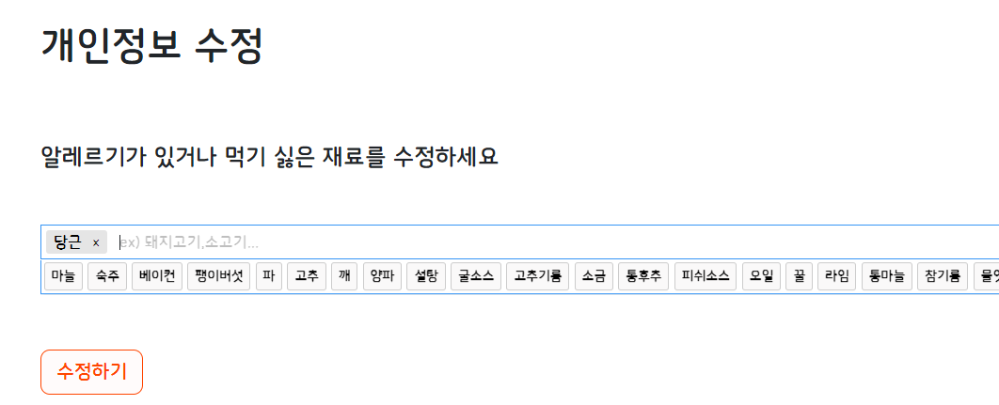
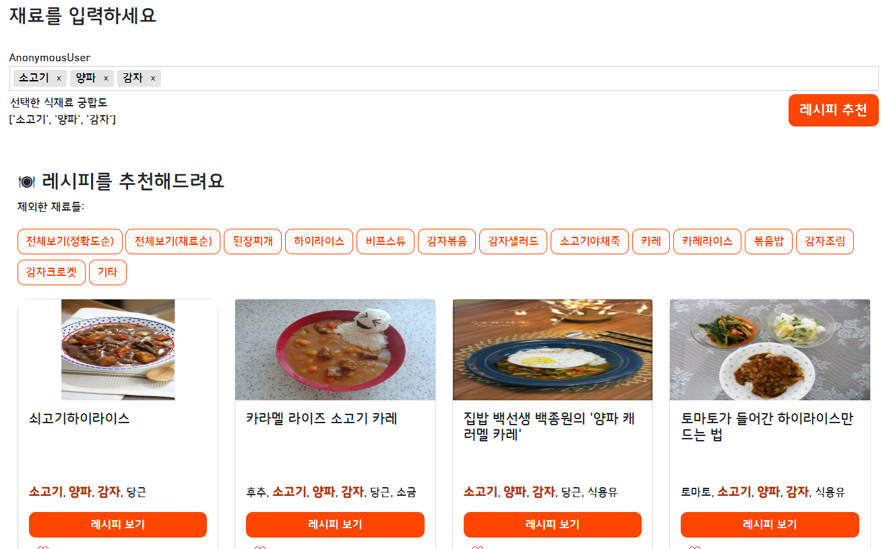

# 파일/폴더 내용

---

1. `recipe_model.py`: 레시피 추천 모델, 재료추천 모델
2. `home`: 레시피 추천 화면 기능
3. `accounts`: 로그인/ 싫은 재료 등록 화면 기능
4. `model_data`:  `Word2Vec` 파일 이외 데이터들
5. `templates`: 웹사이트 html/css/js

# 시연 영상

---

 영상 링크: https://youtu.be/y-I08XXsMek

